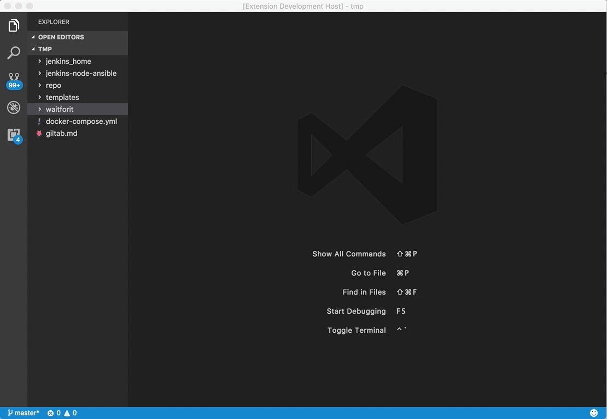

# GitLab-CI Templates

This extension help you to create `.gitlab-ci.yml` file from GitLab-CI templates

## Features

This extension pull GitLab-CI template from a git repository.

By default, GitLab-CI templates are coming from [GitLab-CE](https://gitlab.com/gitlab-org/gitlab-ce) repository.
Templates are saved in your `.vscode` directory.

## Requirements

- Git
